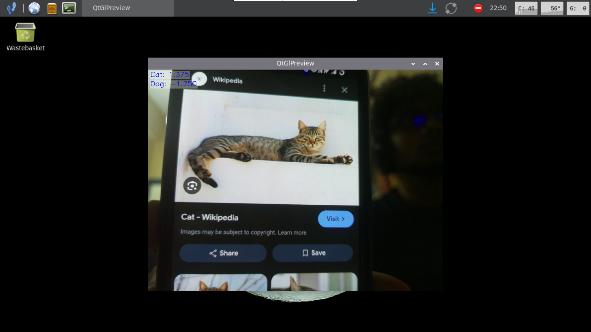
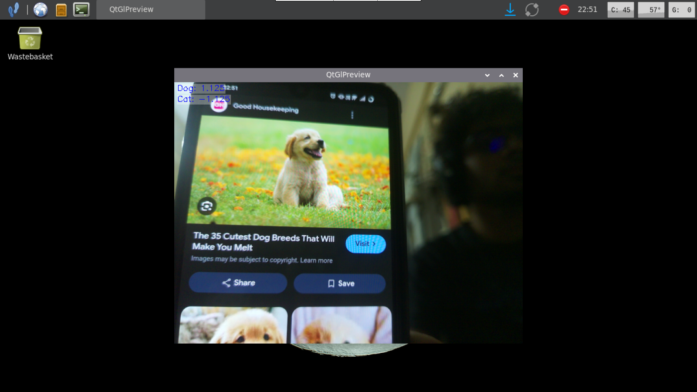

# Train your own custom model on your own dataset

## ON PC

### dataset prep

- run [this](./models/custom-imagenet/prep-data-1.py) and [this](./models/custom-imagenet/prep-data-2.py) script

- run the code in the virtual environment and it should prepare the dataset in a format imagenet can process it eaily.

### training the model

- run [this](./models/custom-imagenet/train.py) script

- this will take a while and run 3 epochs with 8 batches (increase it if your GPU can handle it) and the model should be ready in an `.onnx` file

### converting the model to make it compatible with IMX500

- run ```imxconv-pt -i cat_dog_imx.onnx -o cat-dog```

- this will convert it to `packerOut.zip`

---

## ON PI

### send the file from pc to pi

- i personally use a http server on my pc using `python -m http.server --bind 192.168.0.x` (ON PC)

- on pi, run `wget http://192.168.0.x:8000/packerOut.zip`

### convert the `packerOut.zip` to `network.rpk` (The final package)

- run ```imx500-package -i packerOut.zip -o network.rpk```

- this is the final step and then the model will be usable freely

### run the model

- ```git clone git clone https://github.com/raspberrypi/picamera2.git picamera2```

- ```cd /home/bhu5/models/6-custom-imagenet``` (the folder that contains the `.rpk` file)

- ```python ~/picamera2/examples/imx500/imx500_classification_demo.py --model network.rpk/network.rpk```

- ```mkdir -p assets; echo "Cat \nDog" > assets/imagenet_labels.txt```

- follow the [hacks](./hacks.md#jan-29-2026)

---

### inference

- confidence score is in the top left of the camera window

| Cat | Dog |
| :---: | :---: |
|  |  |
